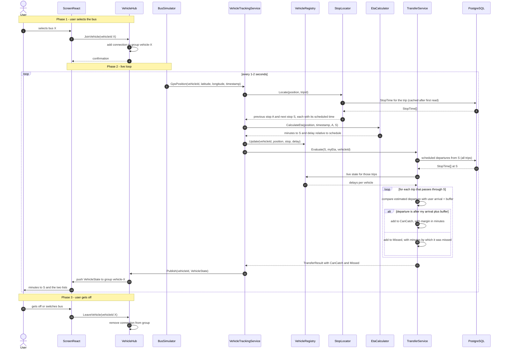

```mermaid
sequenceDiagram
    autonumber
    actor User
    participant UI as ScreenReact
    participant Hub as VehicleHub
    participant Sim as BusSimulator
    participant Svc as VehicleTrackingService
    participant Reg as VehicleRegistry
    participant Loc as StopLocator
    participant Eta as EtaCalculator
    participant Tr as TransferService
    participant DB as PostgreSQL

    Note over User,Hub: Phase 1 - user selects the bus
    User->>UI: selects bus X
    UI->>Hub: JoinVehicle(vehicleId X)
    Hub->>Hub: add connection to group vehicle-X
    Hub-->>UI: confirmation

    Note over Sim,UI: Phase 2 - live loop
    loop every 1-2 seconds
        Sim->>Svc: GpsPosition(vehicleId, latitude, longitude, timestamp)
        Svc->>Loc: Locate(position, tripId)
        Loc->>DB: StopTime for the trip (cached after first read)
        DB-->>Loc: StopTime[]
        Loc-->>Svc: previous stop A and next stop S, each with its scheduled time

        Svc->>Eta: CalculateEta(position, timestamp, A, S)
        Eta-->>Svc: minutes to S and delay relative to schedule
        Svc->>Reg: Update(vehicleId, position, stop, delay)

        Svc->>Tr: Evaluate(S, myEta, vehicleId)
        Tr->>DB: scheduled departures from S (all trips)
        DB-->>Tr: StopTime[] at S
        Tr->>Reg: live state for those trips
        Reg-->>Tr: delays per vehicle

        loop for each trip that passes through S
            Tr->>Tr: compare estimated departure with user arrival + buffer
            alt departure is after my arrival plus buffer
                Tr->>Tr: add to CanCatch, with margin in minutes
            else
                Tr->>Tr: add to Missed, with minutes by which it was missed
            end
        end

        Tr-->>Svc: TransferResult with CanCatch and Missed
        Svc->>Hub: Publish(vehicleId, VehicleState)
        Hub->>UI: push VehicleState to group vehicle-X
        UI->>User: minutes to S and the two lists
    end

    Note over User,Hub: Phase 3 - user gets off
    User->>UI: gets off or switches bus
    UI->>Hub: LeaveVehicle(vehicleId X)
    Hub->>Hub: remove connection from group
```